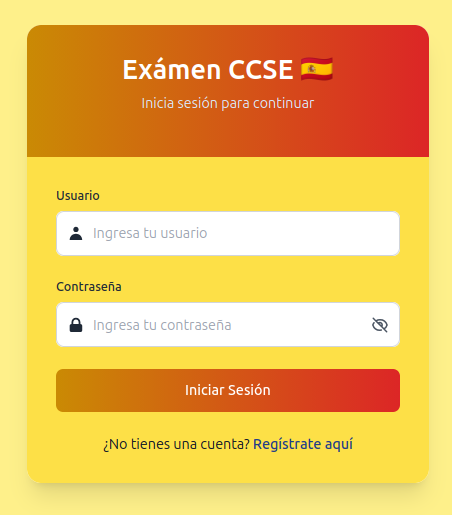
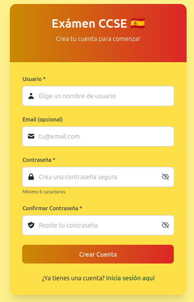
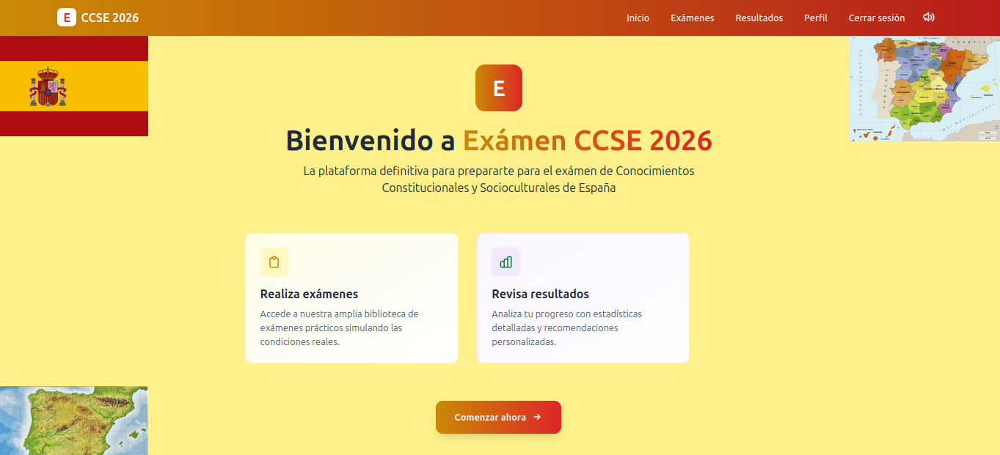
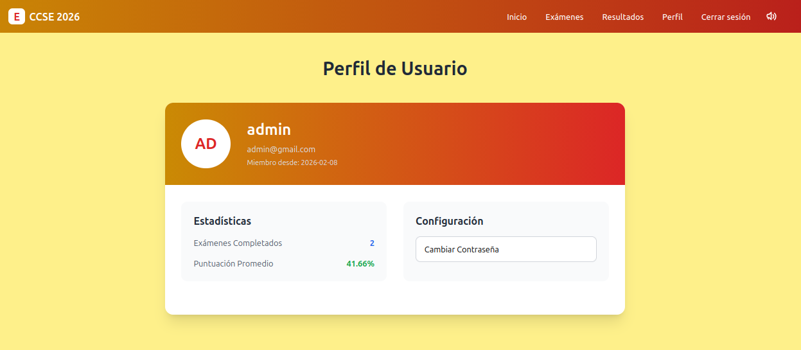
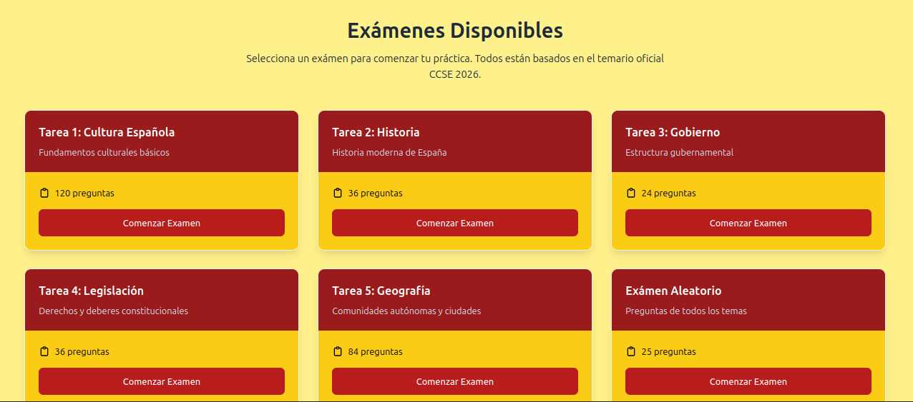
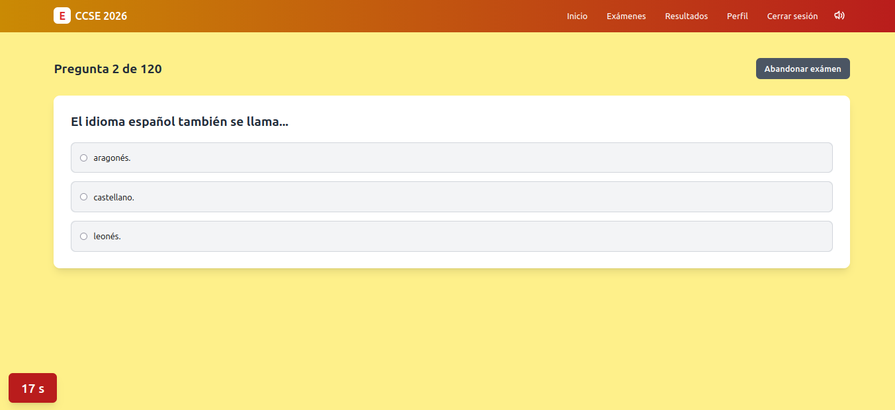
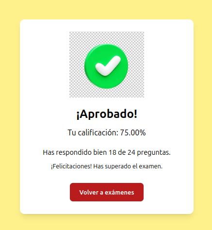
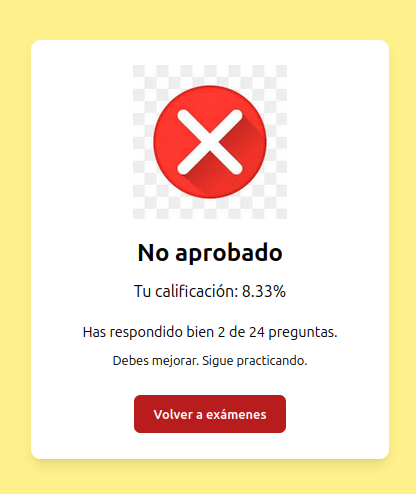
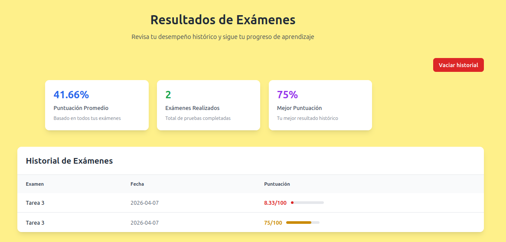

# 📘 Exámen CCSE 2026

Aplicación web interactiva de preparación para el exámen **CCSE** (Conocimientos Constitucionales y Socioculturales de España), utilizada para la obtención de la nacionalidad española. Simula exámenes oficiales con temporizador, opciones múltiples, feedback visual y sonoro, y guarda el historial de resultados.

## ✨ Características

- 🔐 **Autenticación de usuarios** (registro / inicio de sesión) con token.
- 📚 **Exámenes por temas** (Tarea 1 a 5) + **exámen aleatorio** (25 preguntas mezcladas).
- ⏱️ **Temporizador de 30 segundos por pregunta** con sonido de reloj y salto automático.
- 🔊 **Feedback de audio** (acierto, error, fin de exámen).
- 🟢 **Feedback visual**: opción correcta e incorrecta resaltada.
- 📊 **Resultados finales** con calificación, aciertos y mensaje de aprobado/desaprobado.
- 🏆 **Imagen especial** al obtener 100% de aciertos.
- 🗑️ **Vaciar historial** de resultados.
- 📈 **Estadísticas globales** (promedio, mejor puntuación, total exámenes).
- 📱 **Diseño responsive** para móviles y escritorio.

## 🛠️ Tecnologías

### Frontend
- React 18
- React Router DOM
- Tailwind CSS
- Axios
- HTML5 Audio API

### Backend
- Django REST Framework
- Token Authentication
- PostgreSQL

### 📂 Estructura del proyecto

```
examen-ccse/
├── backend/                 # Django REST API
│   ├── app_ccse/            # Aplicación principal
│   ├── requirements.txt
│   └── manage.py
└── frontend/                # React + Tailwind
    ├── src/
    │   ├── api/             # Llamadas a la API
    │   ├── components/      # Componentes reutilizables
    │   ├── pages/           # Páginas (Login, Registro, Inicio, Examen, ...)
    │   ├── App.jsx
    │   └── main.jsx
    ├── public/
    └── package.json
```

### Imágenes de la aplicación

<br>

**Login**


<br><br>

**Registro**


<br><br>

**Inicio**


<br><br>

**Perfil de usuario**


<br><br>

**Exámenes**


<br><br>

**Exámen**


<br><br>

**Aprobado**


<br><br>

**Desaprobado**


<br><br>


**Resultados**


<br><br>

